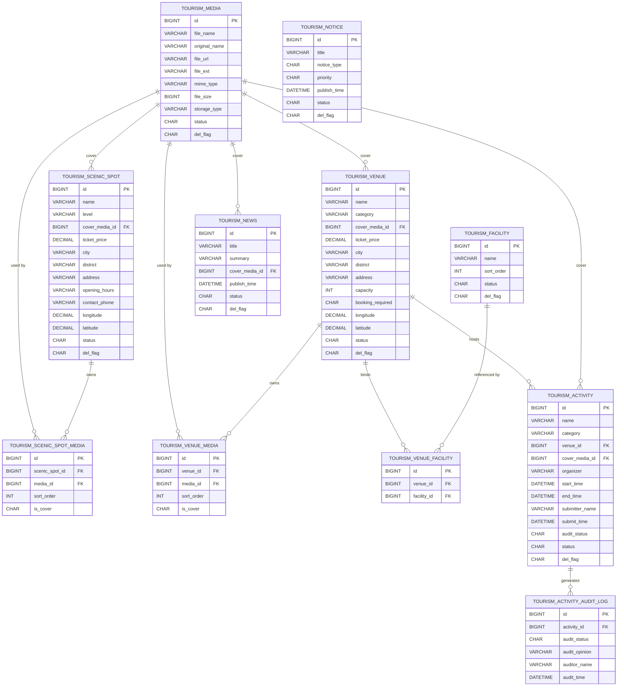
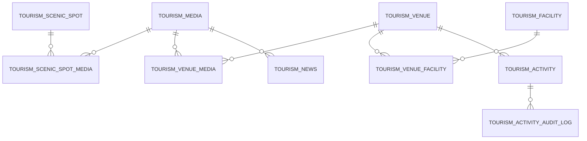
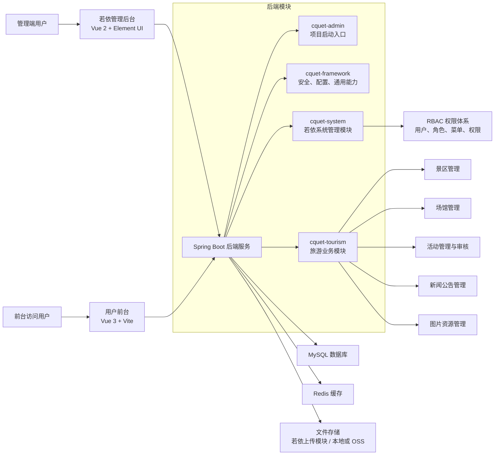
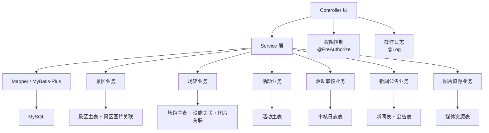

# 旅游模块一期 E-R 图与架构图

本文档用于配合论文“数据库设计”与“系统架构设计”章节，基于旅游模块一期 V2 方案整理图示内容。

适用范围：

- 一期系统聚焦文旅资源管理后台
- 核心对象包括景区、场馆、活动、资讯、公告
- 明确不将“用户报名”纳入一期核心数据库设计

## 图 1 旅游模块一期核心 E-R 图

可作为论文中的：

- 图 4-1 旅游模块一期数据库 E-R 图

### 图 1 说明

- 景区与场馆是一期最核心的文旅资源主实体
- 图片资源统一进入 `tourism_media`，通过封面外键和关联表两种方式服务业务主表
- 场馆与设施为多对多关系，因此通过 `tourism_venue_facility` 进行关联
- 活动依附于场馆存在，并通过 `tourism_activity_audit_log` 保存审核历史
- 新闻与公告属于内容发布模块，其中新闻允许关联封面图，公告以文本发布为主

## 图 2 旅游模块一期简化 E-R 图

可作为论文中更适合排版的小图版本：

- 图 4-2 旅游模块一期主要实体关系图

### 图 2 说明

该图省略了大部分属性字段，仅用于展示一期核心实体之间的主从与关联关系，更适合放在论文正文中进行整体说明。

## 图 3 系统总体架构图

可作为论文中的：

- 图 4-3 系统总体架构图

### 图 3 说明

- 系统整体采用前后端分离架构
- 管理后台基于若依 Vue 版实现后台治理功能
- 用户前台通过只读接口访问旅游资源数据
- 后端以 `cquet-tourism` 模块承载旅游业务逻辑，以 `cquet-system` 提供权限与系统管理基础能力
- 图片资源通过若依上传模块管理，数据库中保存资源元数据与业务关联关系

## 图 4 旅游模块后台业务架构图

可作为论文中的：

- 图 4-4 旅游模块后台业务架构图

### 图 4 说明

该图用于说明旅游模块内部采用的典型三层架构：

- Controller 层负责请求接收、参数校验、权限拦截和统一响应
- Service 层负责业务规则实现与事务控制
- Mapper 层负责数据访问
- 数据层通过主表、字典表、关联表和日志表共同构成较规范的业务模型

## 论文中可直接引用的图题建议

- 图 4-1 旅游模块一期数据库 E-R 图
- 图 4-2 旅游模块一期主要实体关系图
- 图 4-3 系统总体架构图
- 图 4-4 旅游模块后台业务架构图

## 论文中可直接引用的说明文字

可在图后补充如下表述：

> 本系统一期围绕景区、场馆、活动、新闻公告等核心业务构建数据库模型，采用主表、资源表、关联表与日志表相结合的设计方式。其中，景区与场馆作为文旅资源主实体，活动作为依附于场馆的业务实体，图片资源通过独立媒体表统一管理，多图关系通过关联表表达，审核过程通过日志表记录历史信息。该设计既满足系统业务需求，又符合数据库规范化原则，便于后续维护和扩展。
